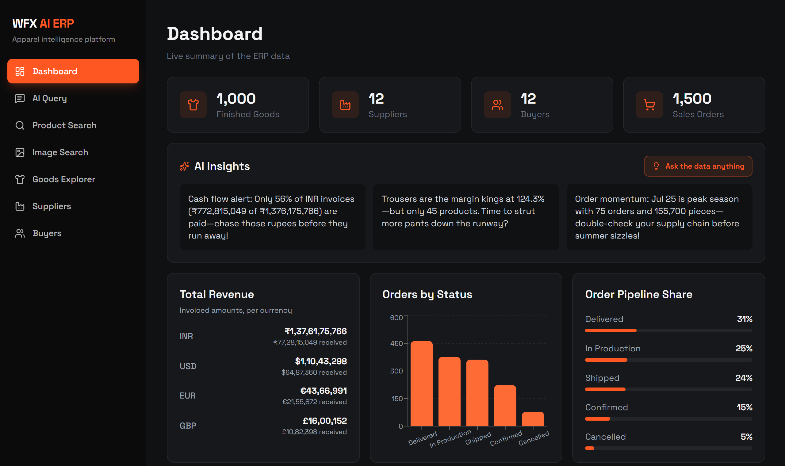
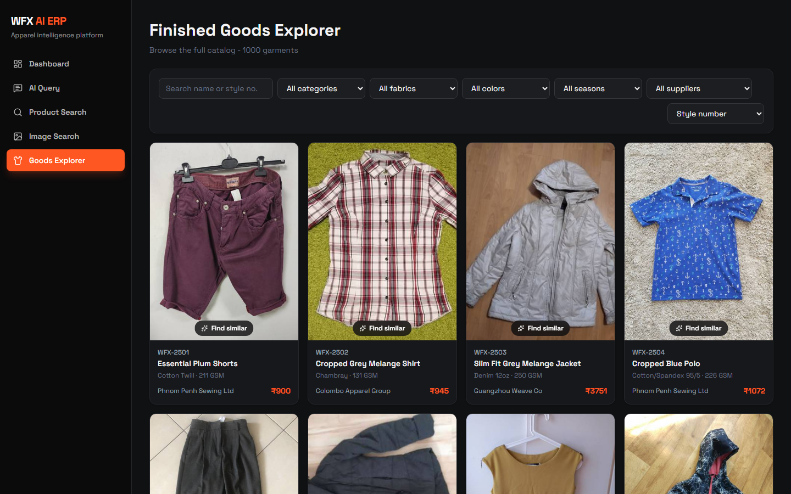
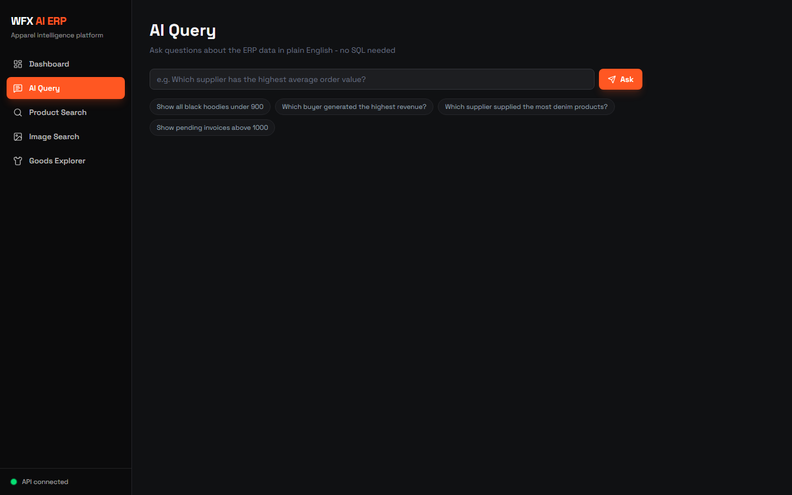
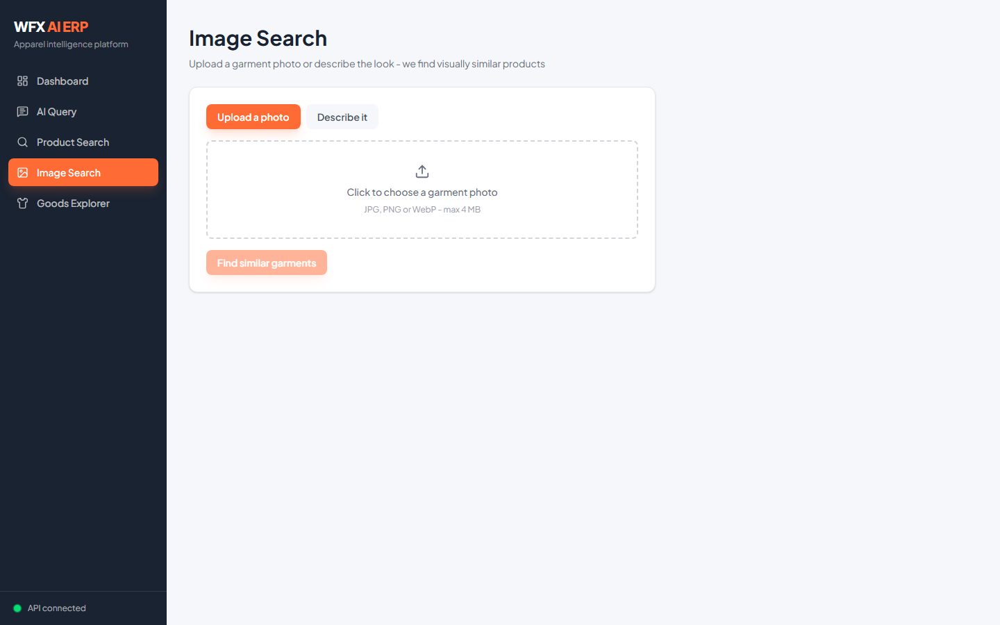
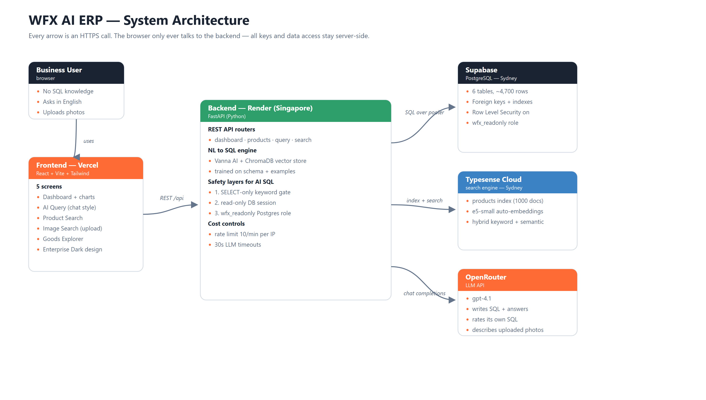
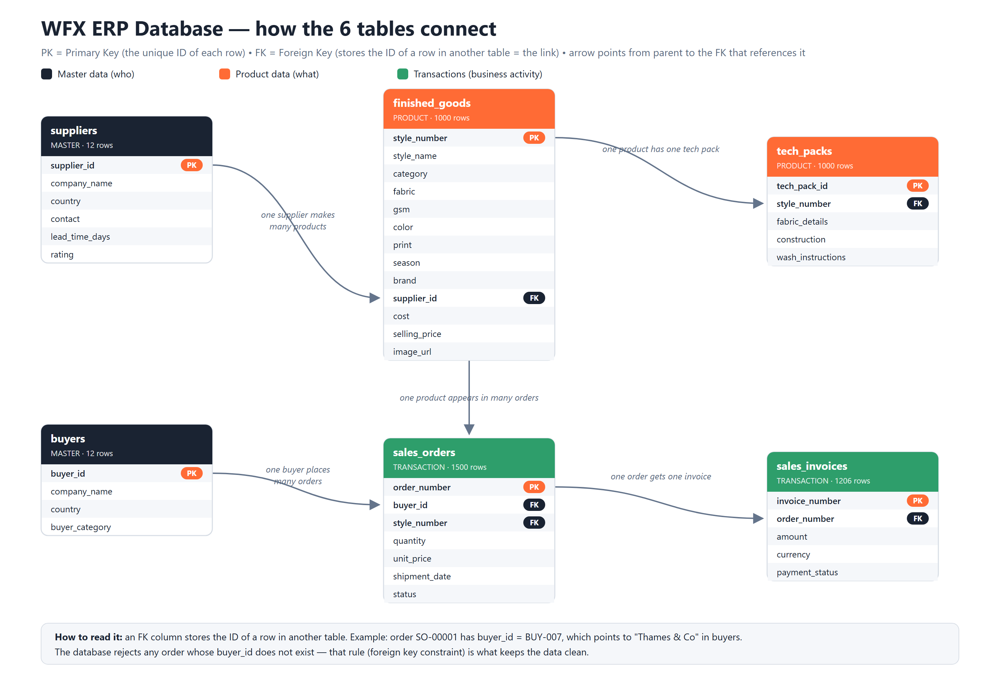

# WFX AI ERP Explorer

An AI-native exploration platform built on top of apparel-industry ERP data.
Business users ask questions in plain English, search products by meaning or by
photo, and browse the catalog — without writing SQL or learning ERP screens.

| | |
|---|---|
| **Live frontend** | https://wfx-ai-erp.vercel.app |
| **Live backend** | https://wfx-erp-api.onrender.com |
| **Interactive API docs** | https://wfx-erp-api.onrender.com/docs |

> The backend runs on Render's free tier, which puts idle services to sleep.
> The first request after a quiet period can take ~30-60 seconds while the
> server wakes up — every request after that is fast.

## Screenshots

| Dashboard | Finished Goods Explorer |
|---|---|
|  |  |

| AI Query | Image Search |
|---|---|
|  |  |

## Features

**Mandatory scope**
- Supabase (PostgreSQL) database with the full ERP schema: finished goods, suppliers, buyers, sales orders, tech packs, sales invoices (~4,700 rows)
- **Natural Language → SQL**: ask "Show all black hoodies under 900" and see the generated SQL, the result table, and a plain-English answer
- **Product search** (Typesense): typo-tolerant, hybrid keyword + semantic search — "cozy winter hoodie" works even without exact keyword matches
- Five frontend screens: Dashboard, AI Query, Product Search, Image Search, Finished Goods Explorer (pagination, sorting, filtering)
- Clean REST APIs for every feature, deployed on Render + Vercel

**Beyond the minimum**
- **Image search by photo upload** — upload a garment photo, get visually similar products
- **"Find similar" on every product card** — pure vector nearest-neighbour search over the embeddings
- **AI dashboard insights** — three LLM-written observations about the data (cached hourly), e.g. outstanding payments per currency or margin standouts
- **Product detail view** — click any garment: full attributes, computed margin, supplier profile, **tech pack**, and order history in one popup
- **NL2SQL confidence scores** — the model self-rates each generated query (with a reason) and the UI shows a colored badge
- **Vector embeddings** for semantic search (Typesense `ts/e5-small-v2` auto-embedding)
- Defense-in-depth safety for AI-generated SQL (three independent layers — see below)
- Per-IP rate limiting and LLM call timeouts (cost control)
- **Mobile-responsive layout** — slide-over navigation and adaptive grids on phones
- **High-contrast dark UI** — layered black surfaces, vibrant orange accent, Space Grotesk typography, pinned sidebar
- Rich dashboard analytics: monthly order trend, top buyers by volume, margin by category, revenue per currency
- Automatic search-index self-healing on startup + token-protected reindex endpoint

## System Architecture



**What happens when a user asks "Which buyer generated the highest revenue?"**

1. The React frontend POSTs the question to `POST /api/query` on the FastAPI backend.
2. Vanna AI retrieves the most relevant training snippets (table definitions, business notes, example question→SQL pairs) from its local ChromaDB vector store.
3. Those snippets + the question go to `gpt-4.1` via OpenRouter, which writes a SQL query.
4. The backend validates the SQL (single read-only SELECT only), then executes it as a **read-only database user** with an 8-second time limit.
5. The result rows go back to the LLM once more to produce a short plain-English answer.
6. The frontend shows all four artifacts: question, generated SQL, result table, answer.

**Image search flow:** the uploaded photo goes to a vision-capable model
(`gpt-4.1`, low-detail mode) which writes a short product description —
e.g. *"black oversized hoodie, solid, casual"* — and that description feeds the
same semantic search as text queries. This deliberately reuses the existing
vector index instead of running a separate CLIP model, which would not fit the
free search cluster's memory (trade-off documented below).

## Tech Stack

| Layer | Technology | Why |
|---|---|---|
| Database | Supabase (PostgreSQL) | Managed Postgres, RLS, connection pooling |
| Backend | FastAPI (Python) | Simple, typed, auto-generated OpenAPI docs |
| NL → SQL | Vanna AI 0.7.9 + ChromaDB | Open-source NL2SQL framework; retrieval-augmented SQL generation |
| LLM | OpenRouter → `gpt-4.1` | Excellent at SQL, vision-capable, still low-cost per query |
| Search | Typesense Cloud | Typo tolerance + built-in vector embeddings (hybrid search) |
| Frontend | React + Vite + Tailwind CSS | Fast dev loop, small bundle, design-system friendly |
| Charts | Recharts | Simple declarative charts |
| Hosting | Render (API) + Vercel (frontend) | As required by the brief |

Vanna is pinned to **0.7.9** — the stable, documented API line
(`vanna.chromadb` / `vanna.openai`). The 2.x rewrite changed the whole API
surface. ChromaDB is installed `>=1.0` because older versions need a C++
compiler on Windows; the embedding function is instantiated once and shared to
avoid reloading the ~90 MB ONNX model on every call.

## Database Schema



- The source CSVs reference other records **by name** (e.g. an order stores
  `"Thames & Co"`). The import script resolves names to IDs, so the database
  uses proper **foreign keys** — Postgres itself rejects an order pointing to a
  buyer that doesn't exist.
- Indexes cover the columns used by filters and joins (category, color, season,
  buyer, status, ...).
- **Row Level Security** is enabled on every table. The backend uses the
  service connection; the `wfx_readonly` role can only SELECT, through explicit
  RLS policies.

## AI SQL Safety — three independent layers

AI-generated SQL is untrusted input. A single check can be fooled, so three
independent layers each have to fail before anything bad happens:

1. **Keyword gate (application):** only a single statement starting with
   `SELECT`/`WITH` is allowed; `insert / update / delete / drop / create /
   into / copy / grant / ...` are rejected, as are multi-statement tricks
   (`select 1; drop table x`).
2. **Read-only session (driver):** the connection is opened with
   `readonly=True`, so Postgres refuses writes at the session level even if the
   gate missed something.
3. **Read-only role (database):** the query runs as `wfx_readonly`, a user that
   has `SELECT`-only grants and no write permission at all — enforced by the
   database, independent of any application code.

Plus operational guards: 8-second statement timeout, 200-row response cap,
30-second LLM timeouts, and a 10-requests/minute/IP rate limit on the
endpoints that cost money.

## API Reference

Interactive documentation with try-it-out: **[/docs](https://wfx-erp-api.onrender.com/docs)**

| Method | Path | Purpose |
|---|---|---|
| GET | `/health` | Liveness check (used by the frontend status dot) |
| GET | `/api/dashboard/stats` | Totals, revenue per currency, order trends, buyers, margins |
| GET | `/api/dashboard/insights` | Three AI-written observations about the data (cached 1h) |
| GET | `/api/products` | Filtered, sorted, paginated product list |
| GET | `/api/products/filters` | All filter options for the UI dropdowns |
| GET | `/api/products/{style_number}` | Product detail: attributes, tech pack, order history |
| POST | `/api/query` | Natural-language question → SQL → rows → answer |
| GET | `/api/search?q=...` | Hybrid keyword + semantic product search |
| GET | `/api/search/similar/{style_number}` | Vector nearest-neighbour "find similar" |
| POST | `/api/search/by-image` | Photo upload → vision description → semantic search |
| POST | `/api/search/reindex` | Rebuild search index (requires `X-Admin-Token` header) |

## Repository Structure

The repo uses one branch per deployable unit:

| Branch | Contents | Deploys to |
|---|---|---|
| `main` | Documentation, database schema + import scripts | — |
| `backend` | FastAPI application (`backend/`) | Render (auto-deploy on push) |
| `frontend` | React application (`frontend/`) | Vercel |

## Local Setup

**Prerequisites:** Python 3.12, Node 20+, a Supabase project, a Typesense Cloud
cluster, an OpenRouter API key.

**1. Database (branch `main`)**

```bash
# create the tables: paste database/schema.sql into the Supabase SQL Editor and run it
# create the read-only role: paste database/readonly_role.sql (set your own password)

# place the provided CSV files into data/   (not committed - the sample data is confidential)
cd database
cp .env.example .env        # fill in your Supabase URL + service key
pip install -r requirements.txt
python import_data.py       # loads ~4,700 rows
```

**2. Backend (branch `backend`)**

```bash
git checkout backend
cd backend
cp .env.example .env        # fill in all values (see the table in .env.example)
pip install -r requirements.txt
uvicorn app.main:app --reload
# first start downloads an ~80MB embedding model, trains Vanna,
# and builds the Typesense index automatically
```

**3. Frontend (branch `frontend`)**

```bash
git checkout frontend
cd frontend
npm install
npm run dev                  # opens on http://localhost:5173
# the frontend calls http://127.0.0.1:8000 by default; set VITE_API_URL to override
```

## Deployment

**Render (backend)** — web service on the `backend` branch, root directory `backend`, region Singapore (closest to the Sydney-hosted database and search cluster):

- Build: `pip install -r requirements.txt && python warmup.py`
  (`warmup.py` pre-downloads the embedding model during build, because Render's
  disk is wiped on each deploy — this keeps startup fast)
- Start: `uvicorn app.main:app --host 0.0.0.0 --port $PORT`
- Environment variables: everything from `backend/.env.example` plus `PYTHON_VERSION=3.12.10`

**Vercel (frontend)** — project root `frontend`, framework Vite, one
environment variable: `VITE_API_URL=https://wfx-erp-api.onrender.com`.
`vercel.json` rewrites every path to `index.html` so React Router handles deep
links like `/query`.

## Design Decisions & Trade-offs

- **Revenue is reported per currency.** Invoices exist in INR, USD, EUR and GBP;
  summing them into one number would be meaningless. The dashboard shows each
  currency separately (invoiced vs actually paid). Converting at a fixed rate
  was rejected because no rate source was specified in the data.
- **Names → foreign keys at import time.** Costs ~10 lines in the import script,
  buys real referential integrity.
- **Image search via vision-description instead of CLIP embeddings.** True CLIP
  image vectors need ~350 MB+ of model memory on the search cluster — more than
  the free tier offers. Describing the photo with a vision LLM and reusing the
  existing semantic index gives good results at ~$0.001 per search. Trade-off:
  it matches what the photo *is* (type, color, style), not pixel-level texture.
- **The sample CSVs are not committed** — the brief marks them confidential, so
  the repo documents where to place them instead.
- **Plain SQL (psycopg2) instead of an ORM.** One consistent data-access style,
  and the NL2SQL feature must execute raw SQL anyway.

## Known Limitations & Future Improvements

- Render free tier cold starts (~30-60 s after idle). Fix: a paid instance or a scheduled ping.
- Vanna retrains on every server boot because the disk is ephemeral (fast — a few seconds — but a persistent vector store would allow accumulating user feedback as new training data).
- Color vocabulary mismatch in image search (a "burgundy" photo vs the catalog's "Plum") — a color-normalization step or CLIP embeddings on a bigger cluster would improve ranking.
- Streaming (word-by-word) answers in the AI Query screen.
- Automatic charts rendered from query results.
- Docker Compose for one-command local setup, and CI on GitHub Actions.
- Authentication and per-user query history.
